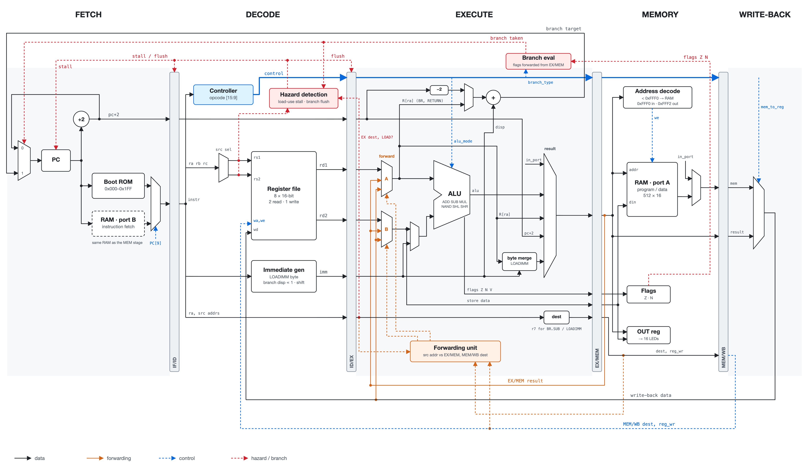

# 16-bit Pipelined CPU (VHDL, Basys-3)

A 16-bit RISC-style CPU with a classic 5-stage pipeline, written in VHDL and running on a Digilent Basys-3 (Artix-7) FPGA. Built between January and April 2026.

[](docs/datapath.svg)

## Table of Contents

- [What It Does](#what-it-does)
- [File Structure](#file-structure)
- [Results](#results)
- [Test Programs](#test-programs)
- [Building](#building)
- [Third-Party Code](#third-party-code)

## What It Does

- **5-stage pipeline:** fetch, decode, execute, memory, write-back
- **Full data forwarding** from EX/MEM and MEM/WB, so back-to-back dependent instructions don't stall
- **Load-use hazard detection** with a single-cycle stall
- **Branch flush** on taken branches, plus flag forwarding so a conditional branch right after `TEST` sees the new flags
- **All three instruction formats** of the target ISA:
  - A: arithmetic, logic, shift, I/O
  - B: branches and subroutine calls
  - L: load, store, immediate, move
- **`BRR.overflow`**, an extra instruction added on top of the spec. It catches multiply overflow and is backed by a full 16-bit signed multiplier.
- **Memory-mapped I/O:** `0xFFF0` reads the 16 slide switches and `0xFFF2` drives the 16 LEDs
- **Memory:** bootloader ROM at `0x0000–0x01FF` and a dual-port program/data RAM at `0x0200–0x07FF`. Instructions are fetched from the ROM or the RAM's second port, so fetch and loads/stores never compete.

## File Structure

```
pipelined-cpu-vhdl/
├── README.md
├── src/
│   ├── design/
│   │   ├── alu.vhd               # 16-bit ALU: add, sub, signed multiply, NAND, shifts, flags
│   │   ├── register_file.vhd     # 8 x 16-bit register file, 2 read ports + 1 write port
│   │   ├── program_counter.vhd   # PC with stall and branch-target load
│   │   ├── flag_register.vhd     # Zero and negative flags
│   │   ├── pipeline_regs.vhd     # IF/ID, ID/EX, EX/MEM, MEM/WB registers with stall + flush
│   │   ├── controller.vhd        # Opcode decoder: control signals for formats A, B and L
│   │   ├── forwarding_unit.vhd   # EX/MEM and MEM/WB bypass selection
│   │   ├── hazard_detection.vhd  # Load-use stall and branch flush
│   │   ├── cpu_top.vhd           # Full datapath, memory map, ROM/RAM and I/O
│   │   └── basys3_wrapper.vhd    # Clock divider, buttons, manual step / auto-run
│   ├── constraints/
│   │   └── basys3.xdc            # Pin and clock constraints
│   └── sim/
│       └── cpu_top_tb.vhd        # Testbench that runs any program image
├── programs/                     # Assembly sources (.asm) and memory images (.mem / .coe)
└── docs/
    ├── datapath.svg              # Datapath diagram
    └── datapath.png
```

### src/design/
The pipeline stages are wired together in `cpu_top.vhd`. Each building block (ALU, register file, PC, flags, pipeline registers, controller, forwarding and hazard units) is its own entity, so it can be tested on its own. `basys3_wrapper.vhd` puts the CPU on the board: it divides the 100 MHz clock, debounces the buttons, and switches between auto-run and single-stepping.

### src/sim/
`cpu_top_tb.vhd` drives the clock, reset and input port. It runs whichever `.mem` image is loaded into the ROM, and you check the results in the waveform.

### programs/
Each test program comes as assembly source plus its assembled memory image. See [Test Programs](#test-programs).

## Results

| | |
|---|---|
| Max clock (derived from post-implementation slack) | ~50.8 MHz |
| LUTs used (as logic) | 909 / 20,800 (4.37%) |
| Simulation | Passes test programs 01–07 below |
| Hardware | Factorial and factorial-with-overflow programs run on the board, with the input from the slide switches |

## Test Programs

| Program | What it checks |
|---|---|
| `01_alu_basics` | IN, ADD, SHL, MUL and OUT, padded with NOPs so no hazards occur |
| `02_data_hazards` | Back-to-back read-after-write dependencies, resolved by forwarding |
| `03_subroutine_and_loop` | A call and return (`BR.SUB` / `RETURN`) around a counted loop |
| `04_signed_multiply` | Multiplication with a negative operand |
| `05_load_store_immediate` | Byte-wise immediate loads, `MOV`, and a store-then-load round trip |
| `06_loop_multiply_add` | A full loop program. It should output 0x00BF (191). |
| `07_loop_nand_shift` | A full loop program. It should output 0xFFFA (-6). |
| `08_factorial` | Factorial of the switch input, shown on the LEDs. Runs on the board. |
| `09_factorial_overflow` | Factorial that uses `BRR.overflow` to output 0 when the multiply overflows. Runs on the board. |

`bootloader` is the ROM program that receives a user program over the input port and copies it into RAM.

## Building

1. Create a Vivado project for the Basys-3 (`xc7a35tcpg236-1`).
2. Add `src/design/*.vhd` as design sources and `src/constraints/basys3.xdc` as the constraint file. Set `basys3_wrapper` as the top module.
3. Copy one of the `programs/*.mem` images to `program.mem`, or point `MEMORY_INIT_FILE` in `cpu_top.vhd` straight at it. The ROM is initialized at bitstream-generation time.
4. Run synthesis and implementation, generate the bitstream and program the board.

**On the board:**

| Control | Function |
|---|---|
| `btnU` | Load |
| `btnC` | Reset and execute |
| `btnL` | Toggle between auto-run and manual stepping |
| `btnR` | Step one clock in manual mode |
| Switches | Input |
| LEDs | Output |

## Third-Party Code

The bootloader and the base test programs come with the target ISA specification. The CPU, the testbench, and the overflow handling in `09_factorial_overflow` are my own work.
